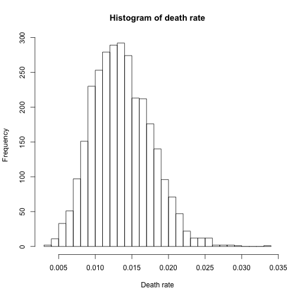

Understanding mortality rates on the US county-level: is prediction possible?
========================================================
author: Kai Li
date: March 15, 2017
autosize: true


Questions
========================================================

- Is predicting the mortalities of US counties possible?
- How accurate the predictions could be, if it's possible by any means?

Backgrounds
========================================================

[County Health Ranking & Roadmaps](http://www.countyhealthrankings.org/), created by the Robert Wood Johnson Foundation and the University of Wisconsin Population Health Institute, is a project to "provide a reliable, sustainable source of local data" concerning local health conditions and to bBuild awareness of the multiple factors that influence health."

It offers annual reports concerning vital health factors covering nearly every US counties, such as high school graduation rates, obesity, smoking, unemployment, access to healthy foods, the quality of air and water, income inequality, and teen births.

What is covered in the annual dataset?
========================================================


[Peppard et al., 2008]

Moreover, level of urbanization is taken from the website of [US Census Bureau](https://www.census.gov/geo/reference/urban-rural.html), based on the 2010 Census data. Three categories are used in the coding, "mostly urban" ("MU"), "mostly rural" ("UR"), and "totally rural"("TR").

Dataset used in this analysis
========================================================


|Variable.name      |Definition                         |Year.period |
|:------------------|:----------------------------------|:-----------|
|Deaths             |Premature deaths numbers           |2011-13     |
|smoker.percent     |Percentage of Smokers              |2014        |
|obesity.percent    |Percentage of obesity              |2012        |
|drinking.percent   |Percentage of obessive drinking    |2014        |
|uninsured.percent  |Percentage of uninsured            |2013        |
|unemployed.percent |Percentage of unemployment         |2014        |
|food.insecure      |Percentage of insecure food access |2013        |
|pm25               |Percentage of health food access   |2010        |
|water.violation    |Average PM 2.5                     |2011        |
|health.food        |Drinking water violation           |2013-14     |
|Rurality           |Level of rurality                  |2010        |

Link: [Project website](http://www.countyhealthrankings.org/sites/default/files/2016CSV_SAS%20DatasetDocumentation.pdf)

Data cleaning
========================================================

All the observations with NA value in Deaths are removed. For all the NA values in other variables, the mean value of all the other observations is used instead.

2,983 out of 3,141 observations are present in the final dataset. The same randomly selected 2,000 and 983 observations were used as the train/test sets in all the analyses.


Method
========================================================

Three methods are used in this study to predict the mortality rate:
- Linear regression
- Decision tree
- Random forest

Distribution of death rates
========================================================



Linear regression
========================================================

The first linear model is based on all predictors.


```r
linear.model.1 <- lm(death.rate ~ ., train.set)
```


|                   |   Estimate| Std. Error|     t value| Pr(>&#124;t&#124;)|
|:------------------|----------:|----------:|-----------:|------------------:|
|(Intercept)        |  0.0088234|  0.0009940|   8.8764515|          0.0000000|
|smoker.percent     |  0.0001717|  0.0000215|   7.9950449|          0.0000000|
|obesity.percent    |  0.0001425|  0.0000162|   8.8216389|          0.0000000|
|drinking.percent   | -0.0003210|  0.0000223| -14.4270530|          0.0000000|
|uninsured.percent  |  0.0000049|  0.0000132|   0.3691128|          0.7120829|
|unemployed.percent |  0.0002909|  0.0000314|   9.2659433|          0.0000000|
|food.insecure      |  0.0001391|  0.0000217|   6.4170012|          0.0000000|
|pm25               | -0.0000217|  0.0000432|  -0.5018701|          0.6158145|
|water.violation    | -0.0001410|  0.0001143|  -1.2335210|          0.2175273|
|health.food        |  0.0000150|  0.0000088|   1.7101705|          0.0873904|
|rurality.indexMR   | -0.0007375|  0.0001591|  -4.6347188|          0.0000038|
|rurality.indexMU   | -0.0024695|  0.0001624| -15.2097455|          0.0000000|

Linear regression (cont.)
========================================================

The second linear model is based on only those predictors that are proven to be relevant in the first model.


```r
linear.model.2 <- lm(death.rate ~ smoker.percent + obesity.percent + drinking.percent + unemployed.percent + food.insecure + rurality.index, 
                     train.set)
```


|                   |   Estimate| Std. Error|    t value| Pr(>&#124;t&#124;)|
|:------------------|----------:|----------:|----------:|------------------:|
|(Intercept)        |  0.0086018|  0.0007002|  12.284744|              0e+00|
|smoker.percent     |  0.0001721|  0.0000207|   8.326068|              0e+00|
|obesity.percent    |  0.0001426|  0.0000159|   8.950781|              0e+00|
|drinking.percent   | -0.0003194|  0.0000207| -15.432966|              0e+00|
|unemployed.percent |  0.0002862|  0.0000312|   9.171223|              0e+00|
|food.insecure      |  0.0001489|  0.0000204|   7.316756|              0e+00|
|rurality.indexMR   | -0.0008286|  0.0001540|  -5.379116|              1e-07|
|rurality.indexMU   | -0.0025447|  0.0001584| -16.069160|              0e+00|

Prediction based on linear models
========================================================

Evaluation of the prediction is based on two criteria:
- Mean absolute error (MAE): mean(|error|) (Based on "Metrics::mae" function)
- Root mean squared error (RMSE): sqrt(mean(error^2)) (Based on "Metrics::rmse" function)


|Model          |Dataset |      MAE|     RMSE|
|:--------------|:-------|--------:|--------:|
|linear.model.1 |Train   | 0.001838| 0.002433|
|linear.model.1 |Test    | 0.001959| 0.002527|
|linear.model.2 |Train   | 0.001843| 0.002436|
|linear.model.2 |Test    | 0.001962| 0.002527|

Tree model 
========================================================

A tree model is established between the mortality rate and all the other predictors. However, the results of the model seem to suggest that the data doesn't fit into a tree model very well.


|        CP| nsplit| rel error|    xerror|      xstd|
|---------:|------:|---------:|---------:|---------:|
| 0.3077878|      0| 1.0000000| 1.0007669| 0.0329336|
| 0.0590877|      1| 0.6922122| 0.6930948| 0.0272943|
| 0.0583371|      2| 0.6331244| 0.6449390| 0.0262352|
| 0.0407724|      3| 0.5747873| 0.5915776| 0.0242473|
| 0.0219282|      4| 0.5340149| 0.5569252| 0.0233137|
| 0.0194978|      5| 0.5120867| 0.5370070| 0.0226863|
| 0.0192505|      6| 0.4925889| 0.5285330| 0.0223811|
| 0.0124814|      7| 0.4733384| 0.5030844| 0.0211639|
| 0.0114198|      8| 0.4608570| 0.4841889| 0.0208558|
| 0.0107840|      9| 0.4494372| 0.4780204| 0.0207419|
| 0.0103452|     10| 0.4386532| 0.4737209| 0.0206135|
| 0.0100000|     11| 0.4283080| 0.4727376| 0.0205678|

Tree model (cont.)
========================================================

The tree is pruned at 11 splits. Below is the summary of the prediction, which is higher than that is based on the linear models.


|Dataset |      MAE|     RMSE|
|:-------|--------:|--------:|
|Train   | 0.002019| 0.002614|
|Test    | 0.002189| 0.002845|

Random forest
========================================================

Below is the list of importance of all the predictors. Obessive drinking, unemployment and rurality are some of the top predictors.


```r
set.seed(1)
rf <- randomForest(death.rate ~ ., data = train.set, importance = T)
importance(rf)
```

```
                     %IncMSE IncNodePurity
smoker.percent     32.291938  0.0040661073
obesity.percent    39.940394  0.0030567072
drinking.percent   58.138539  0.0066981455
uninsured.percent  27.203339  0.0018788895
unemployed.percent 57.237346  0.0045858770
food.insecure      34.648823  0.0041511619
pm25               28.782384  0.0017255258
water.violation     2.518078  0.0002348628
health.food        18.959481  0.0015176616
rurality.index     54.370281  0.0027219067
```

Random forest (cont.)
========================================================

Below are the results of prediction based on the random forest model, which is the best among all the three models in this analysis. However, there is also a deep gap between the precisions based on the train and test sets.


|Dataset |      MAE|     RMSE|
|:-------|--------:|--------:|
|Train   | 0.000766| 0.001028|
|Test    | 0.001744| 0.002299|

What does it mean?
========================================================

Let's go back to the histogram in the beginning of this presentation.


Kidney cancer rates in the US counties
========================================================

The counties with the highest and lowest kidney cancer rates in the US: they tend to be "rural, mid-western, southern, and western" (Gelman, 2009).


Kidney cancer rates in the US counties (cont.)
========================================================
